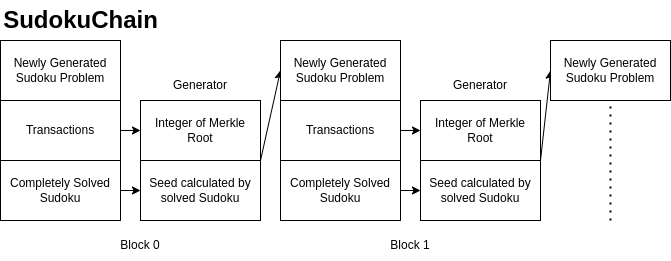

# SUDOKU CHAIN

#### Disclaimer

This design was made as a completely absurd project.
There are no security guarantees.
On the contrary, there are extremely critical vulnerabilities.
The parameters used are intentionally limited to enable to implement on my personal computer. It is not possible to use this project in real life, as it is possible to pre-calculate the entire blockchain. Please treat it as a concept project and go through without much thought.

## How it works

Modern cryptography relies on difficult questions. Encryptions, digital signatures or cyptographic hash functions are based on a mathematical question that can be solved one-way. In other words, any function that is difficult to compute and easy to verify can be fitted to this system. Currently, in the oldest blockchain, bitcoin proof of work is based on SHA256. Computationally, first 60 bits of the SHA256 digest have to be zero and this probability is 1/(2^60) for random guesses. There is no other way than brute-force and it can be verified in seconds.

On the other hand, Sudoku is a well-known puzzle for most people. In addition it is difficult to solve but very easy to verify just like SHA256 based POWs. Even though 9x9 sudoku can be solved in seconds on personal computers, it can challenge modern hardware requirements with the increase of the size of the sudoku table.



## How do new sudoku problems generate automatically?

There are 6,670,903,752,021,072,936,960 possible discrete results in a 9x9 sudoku. The nice thing about Sudoku is that all these results are results of shuffles of rows, columns or 3x3 blocks. Therefore, it is possible to create all possible sudoku's by randomly changing the position of rows, columns or 3x3 blocks. If we can create a specific random number generator seed for each block, we will find a separate sudoku solution for each block.

If some of the certain digits are deleted by the random number generator (with the same seed), a solvable sudoku puzzle will be obtained. Of course, the remaining digits will affect the solving time (mining time) of this sudoku, which is the equilavent of the length of the PoW in bitcoin.

Notice that, size of sudoku also effects the difficulty level. In addition, parallelization is also possible with sudoku solving algorithms. In this implementation, backtracking has been used.

## How generator seed is calculated?

Obiviously, transactions should effect the sudoku problems with avalanche. Therefore, merkle root implemented to sustain relationship with Sudoku and Txs. However, unlike bitcoin Merkle Root will be casting to integer.
Lets assume, you calculated 123 as merkle tree root. The generator seed is sum of merkle tree root and previous block's solution. This solution is consequitive concatication of all numbers in order.

Result of Sudoku

```bash
[[8 4 3 1 9 2 6 5 7]
 [5 2 1 6 8 7 4 9 3]
 [6 9 7 5 3 4 8 2 1]
 [3 1 6 8 7 9 2 4 5]
 [4 5 8 2 1 3 9 7 6]
 [2 7 9 4 5 6 1 3 8]
 [9 6 5 7 4 1 3 8 2]
 [1 8 4 3 2 5 7 6 9]
 [7 3 2 9 6 8 5 1 4]]

Seed: 843192657521687493697534821316879245458213976279456138965741382184325769732968514

```

Generator Seed

```bash
generatorSeed = MerkleRootInteger + PrevSudokuSolution
newSudokuProblem = GenerateSudoku(generatorSeed)
```

## What about verification?

Verification is the easy concept in Sudoku. Just check each block, row and column for each cell. If everything cells returns True, you verified the block. Congrats !!!

## How can you be sure that there will always be one solution?

I can't. But I can take the first solution that works and build the whole chain on it. Do you think there is only one SHA256 digest whose first 60 bits are 0?

## If you can get new sudoku by modifying a standard sudoku, what is this standard sudoku?

The standart sudoku is the following. Nothing special about it. I got the first sudoku that I've seen on google.

```
[4, 8, 3, 9, 2, 1, 6, 5, 7]
[9, 6, 7, 3, 4, 5, 8, 2, 1]
[2, 5, 1, 8, 7, 6, 4, 9, 3]
[5, 4, 8, 1, 3, 2, 9, 7, 6]
[7, 2, 9, 5, 6, 4, 1, 3, 8]
[1, 3, 6, 7, 9, 8, 2, 4, 5]
[3, 7, 2, 6, 8, 9, 5, 1, 4]
[8, 1, 4, 2, 5, 3, 7, 6, 9]
[6, 9, 5, 4, 1, 7, 3, 8, 2]
```

## What about the performance?

For 3x3 Sudoku:

Level = How many cells should you solve?
This is average of 10000 test runs.

```
python3 Sudoku.py
#:
Level 1
Init: 0.00047912697003994254
Solve: 2.520560001357808e-05
Verify: 0.0004077520800274215
Solve/Verify Time Ratio: 0.06181599370843919
Level 10
Init: 0.0004830567799581331
Solve: 0.00022909791996426066
Verify: 0.0004039838199423684
Solve/Verify Time Ratio: 0.5670967713433259
Level 20
Init: 0.00048461789012435477
Solve: 0.0005719544699786638
Verify: 0.0003878338401591463
Solve/Verify Time Ratio: 1.4747410121405709
Level 30
Init: 0.0004728678300307365
Solve: 0.0014725412300140306
Verify: 0.00024136275002092588
Solve/Verify Time Ratio: 6.100946520895883
Level 40
Init: 0.0004764309999154648
Solve: 0.010971392970022862
Verify: 8.518328995705815e-05
Solve/Verify Time Ratio: 128.7974786551877
Level 50
Init: 0.0004760384500150394
Solve: 0.1492421965898575
Verify: 3.139523008940159e-05
Solve/Verify Time Ratio: 4753.658315765575
Level 60
Init: 0.0005038729402258469
Solve: 4.4332764617499745
Verify: 2.8971490028197877e-05
Solve/Verify Time Ratio: 153022.0384742061
```

As expected, for low values, solving is much easier than verifiying. However, it is 3x3 Sudoku for this limited space (Difficulty = 60), 15302200 % of difference between verification and mining is satisfiying.

## How about Digital Signatures?

I am still using the Eliptic Curve Digital Signature Algorithm as standart.

## How to Run

```
python3 Main_Test.py

Test I: The signature verifies
Test II: The signature verifies
Test III: All transactions verify
**************************
========  SUDOKU  ========
[[3 8 4 2 1 9 7 6 5]
 [7 6 9 0 5 3 1 8 2]
 [1 0 2 7 6 8 3 0 9]
 [8 4 5 3 2 1 6 9 7]
 [0 2 0 0 4 0 8 1 3]
 [6 0 1 9 8 7 5 2 4]
 [0 7 0 8 9 6 4 0 0]
 [0 1 8 5 0 2 9 7 0]
 [5 9 6 1 0 4 2 3 8]]
======== SOLUTION ========
[[3 8 4 2 1 9 7 6 5]
 [7 6 9 4 5 3 1 8 2]
 [1 5 2 7 6 8 3 4 9]
 [8 4 5 3 2 1 6 9 7]
 [9 2 7 6 4 5 8 1 3]
 [6 3 1 9 8 7 5 2 4]
 [2 7 3 8 9 6 4 5 1]
 [4 1 8 5 3 2 9 7 6]
 [5 9 6 1 7 4 2 3 8]]
**************************
**************************
========  SUDOKU  ========
[[4 3 8 0 0 1 5 7 6]
 [2 1 5 8 7 0 9 3 4]
 [9 0 6 3 4 5 2 1 0]
 [1 6 3 7 9 8 4 5 2]
 [7 9 0 5 6 4 3 0 1]
 [5 8 4 1 0 2 7 6 9]
 [8 4 1 0 5 3 0 9 7]
 [6 0 9 4 0 7 8 2 3]
 [3 0 7 6 0 0 1 0 5]]
======== SOLUTION ========
[[4 3 8 9 2 1 5 7 6]
 [2 1 5 8 7 6 9 3 4]
 [9 7 6 3 4 5 2 1 8]
 [1 6 3 7 9 8 4 5 2]
 [7 9 2 5 6 4 3 8 1]
 [5 8 4 1 3 2 7 6 9]
 [8 4 1 2 5 3 6 9 7]
 [6 5 9 4 1 7 8 2 3]
 [3 2 7 6 8 9 1 4 5]]
**************************
**************************
========  SUDOKU  ========
[[2 1 0 6 7 8 4 9 0]
 [9 0 6 0 4 3 8 2 0]
 [4 3 8 1 2 9 0 0 7]
 [5 8 4 0 0 1 9 7 6]
 [1 6 3 8 9 7 2 4 5]
 [7 0 2 4 6 5 1 3 8]
 [0 5 9 0 1 4 3 0 2]
 [3 2 7 9 8 0 5 1 4]
 [8 4 1 3 0 2 7 0 9]]
======== SOLUTION ========
[[2 1 5 6 7 8 4 9 3]
 [9 7 6 5 4 3 8 2 1]
 [4 3 8 1 2 9 6 5 7]
 [5 8 4 2 3 1 9 7 6]
 [1 6 3 8 9 7 2 4 5]
 [7 9 2 4 6 5 1 3 8]
 [6 5 9 7 1 4 3 8 2]
 [3 2 7 9 8 6 5 1 4]
 [8 4 1 3 5 2 7 6 9]]
**************************
**************************
========  SUDOKU  ========
[[0 1 5 6 8 7 3 4 9]
 [9 7 6 5 3 4 1 0 2]
 [4 0 8 0 0 2 7 6 5]
 [7 9 2 4 5 6 8 1 0]
 [5 8 4 2 0 3 6 9 7]
 [1 0 3 8 7 0 0 0 4]
 [6 5 9 7 4 1 2 3 8]
 [8 0 1 3 2 5 9 7 6]
 [3 0 0 9 6 0 0 5 1]]
======== SOLUTION ========
[[2 1 5 6 8 7 3 4 9]
 [9 7 6 5 3 4 1 8 2]
 [4 3 8 1 9 2 7 6 5]
 [7 9 2 4 5 6 8 1 3]
 [5 8 4 2 1 3 6 9 7]
 [1 6 3 8 7 9 5 2 4]
 [6 5 9 7 4 1 2 3 8]
 [8 4 1 3 2 5 9 7 6]
 [3 2 7 9 6 8 4 5 1]]
**************************
**************************
========  SUDOKU  ========
[[4 0 0 0 2 1 7 5 6]
 [0 7 6 3 4 5 1 2 8]
 [2 1 5 8 7 6 3 0 4]
 [7 9 2 5 0 4 8 0 1]
 [5 0 4 1 3 2 6 0 9]
 [0 6 0 0 9 8 5 4 2]
 [0 5 9 4 1 7 0 8 3]
 [3 2 7 6 8 9 4 1 5]
 [8 4 0 2 0 3 9 6 7]]
======== SOLUTION ========
[[4 3 8 9 2 1 7 5 6]
 [9 7 6 3 4 5 1 2 8]
 [2 1 5 8 7 6 3 9 4]
 [7 9 2 5 6 4 8 3 1]
 [5 8 4 1 3 2 6 7 9]
 [1 6 3 7 9 8 5 4 2]
 [6 5 9 4 1 7 2 8 3]
 [3 2 7 6 8 9 4 1 5]
 [8 4 1 2 5 3 9 6 7]]
**************************
**************************
========  SUDOKU  ========
[[4 8 3 9 0 1 5 7 6]
 [9 6 7 0 0 5 2 1 8]
 [0 5 1 8 7 6 9 0 4]
 [1 0 6 7 9 8 4 5 2]
 [0 2 9 5 6 4 3 8 1]
 [5 4 8 1 3 2 7 0 9]
 [6 0 0 4 0 7 8 2 3]
 [0 1 4 2 0 3 6 0 7]
 [0 7 2 6 0 9 1 4 5]]
======== SOLUTION ========
[[4 8 3 9 2 1 5 7 6]
 [9 6 7 3 4 5 2 1 8]
 [2 5 1 8 7 6 9 3 4]
 [1 3 6 7 9 8 4 5 2]
 [7 2 9 5 6 4 3 8 1]
 [5 4 8 1 3 2 7 6 9]
 [6 9 5 4 1 7 8 2 3]
 [8 1 4 2 5 3 6 9 7]
 [3 7 2 6 8 9 1 4 5]]
**************************
**************************
========  SUDOKU  ========
[[3 8 4 2 9 1 0 6 5]
 [7 6 9 4 3 5 1 8 2]
 [1 0 0 7 8 0 3 4 0]
 [6 3 1 9 7 8 5 2 4]
 [0 4 5 0 1 0 6 9 7]
 [9 2 0 6 5 4 0 1 0]
 [4 0 8 5 2 3 9 7 6]
 [5 9 6 1 4 7 0 0 0]
 [2 7 3 8 6 9 4 5 0]]
======== SOLUTION ========
[[3 8 4 2 9 1 7 6 5]
 [7 6 9 4 3 5 1 8 2]
 [1 5 2 7 8 6 3 4 9]
 [6 3 1 9 7 8 5 2 4]
 [8 4 5 3 1 2 6 9 7]
 [9 2 7 6 5 4 0 1 8]
 [4 1 8 5 2 3 9 7 6]
 [5 9 6 1 4 7 8 0 3]
 [2 7 3 8 6 9 4 5 1]]
**************************
**************************
========  SUDOKU  ========
[[5 2 1 7 0 6 3 4 9]
 [6 0 7 0 3 5 1 8 2]
 [8 0 0 2 9 1 7 0 0]
 [0 1 6 9 7 8 5 2 4]
 [4 5 8 3 1 2 6 9 0]
 [2 7 9 6 5 4 0 1 3]
 [9 6 5 1 4 7 2 3 8]
 [7 3 0 0 0 9 0 5 1]
 [1 0 0 5 2 3 9 7 6]]
======== SOLUTION ========
[[5 2 1 7 8 6 3 4 9]
 [6 9 7 4 3 5 1 8 2]
 [8 4 3 2 9 1 7 6 5]
 [3 1 6 9 7 8 5 2 4]
 [4 5 8 3 1 2 6 9 7]
 [2 7 9 6 5 4 8 1 3]
 [9 6 5 1 4 7 2 3 8]
 [7 3 2 8 6 9 4 5 1]
 [1 8 4 5 2 3 9 7 6]]
**************************
**************************
========  SUDOKU  ========
[[0 0 0 9 1 2 0 7 5]
 [2 5 0 8 6 7 4 3 0]
 [9 6 0 3 5 4 0 1 2]
 [5 4 8 1 2 3 9 6 7]
 [1 0 6 7 0 9 2 5 4]
 [7 0 9 5 4 6 0 8 3]
 [6 9 5 4 7 1 3 2 8]
 [3 7 2 6 9 0 0 4 1]
 [8 1 4 2 0 5 7 9 0]]
======== SOLUTION ========
[[4 8 3 9 1 2 6 7 5]
 [2 5 1 8 6 7 4 3 9]
 [9 6 7 3 5 4 8 1 2]
 [5 4 8 1 2 3 9 6 7]
 [1 3 6 7 8 9 2 5 4]
 [7 2 9 5 4 6 1 8 3]
 [6 9 5 4 7 1 3 2 8]
 [3 7 2 6 9 8 5 4 1]
 [8 1 4 2 3 5 7 9 6]]
**************************
**************************
========  SUDOKU  ========
[[0 0 8 2 0 1 5 7 6]
 [9 0 6 4 0 5 0 1 8]
 [2 1 5 7 8 6 0 3 4]
 [1 0 3 9 0 8 4 5 2]
 [7 9 2 0 5 4 3 8 1]
 [5 8 4 3 1 2 7 6 9]
 [6 5 0 1 4 7 0 2 3]
 [3 0 0 8 6 9 1 4 5]
 [8 0 1 0 2 3 6 9 7]]
======== SOLUTION ========
[[4 3 8 2 9 1 5 7 6]
 [9 7 6 4 3 5 2 1 8]
 [2 1 5 7 8 6 9 3 4]
 [1 6 3 9 7 8 4 5 2]
 [7 9 2 6 5 4 3 8 1]
 [5 8 4 3 1 2 7 6 9]
 [6 5 9 1 4 7 8 2 3]
 [3 2 7 8 6 9 1 4 5]
 [8 4 1 5 2 3 6 9 7]]
**************************
Block 0 passed Test V
Block 1 passed Test V
Block 2 passed Test V
Block 3 passed Test V
Block 4 passed Test V
Block 5 passed Test V
Block 6 passed Test V
Block 7 passed Test V
Block 8 passed Test V
Block 9 passed Test V
```

## Contributions

Please don't contribute, thanks!

## License

Apache License 2.0
